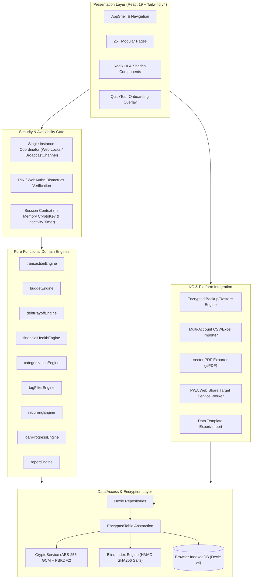
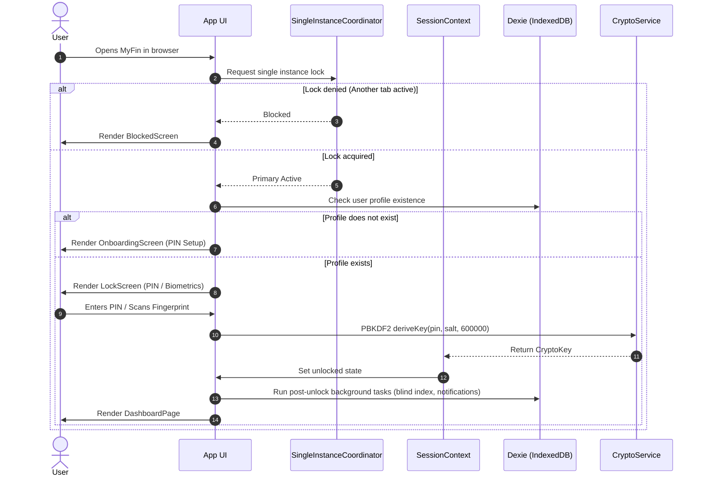
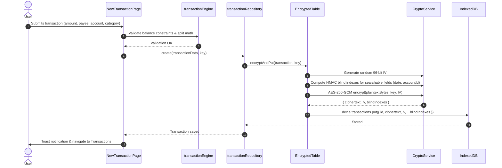

# MyFin — System Architecture & Technical Design

This document details the architectural principles, system design, security model, and data flow of MyFin.

---

## 1. High-Level Architecture Overview

MyFin is an **offline-first, zero-knowledge, local-first Progressive Web Application (PWA)** for personal financial management. All sensitive financial records are encrypted directly on the client device before touching IndexedDB. No external servers or telemetry collect user financial data.

---

## 2. Core Architectural Principles

### 1. Zero-Knowledge Local Storage
- Encryption keys are derived in volatile memory from the user's PIN or WebAuthn biometrics using PBKDF2 with 600,000 rounds.
- Unencrypted financial data (account numbers, balances, payees, notes, amounts, tags) **never exists in persistent storage**.
- Only ciphertext and initialization vectors (IVs) are committed to IndexedDB.

### 2. Functional Core, Imperative Shell
- All business calculations (balance recalculation, debt payoff projection, financial health scoring, rollover budgets, loan interest, recurring event projection) live in **pure, side-effect-free TypeScript functions** under `src/domain/`.
- Repositories under `src/data/dexie/` handle persistence and encryption; UI components only consume computed domain results.

### 3. Concurrency Protection via Single-Instance Lock
- IndexedDB operations across multiple tabs run the risk of stale cache reads or conflicting writes.
- MyFin uses the **Web Locks API** (with fallback to `BroadcastChannel`) in `src/lib/singleInstance.ts` to ensure only one active primary tab can unlock the database. Secondary tabs display a clean `BlockedScreen` until the primary tab is closed.

### 4. Resilient Offline PWA & Share Target
- Service workers manage offline caching for all HTML, CSS, JavaScript, and font assets via Workbox.
- A secondary dedicated service worker (`public/sw-share-target.js`) listens for Android/desktop native OS share events to ingest photos and text snippets without altering offline asset cache policies.

---

## 3. Layered System Architecture

### 3.1 Presentation Layer (`src/components/`, `src/pages/`)
- **React 19 & React Router v7**: Declarative client-side routing across 25+ view surfaces.
- **Tailwind CSS v4 & Nova Aesthetic**: Sleek, high-contrast dark/light design system with zero-runtime CSS variables.
- **Radix UI Primitives**: Accessible dialogs, popovers, dropdowns, tooltips, and sheet drawers.
- **Interactive Tour Engine**: Guided onboarding tour (`QuickTourOverlay.tsx`) with spotlight backdrop masking.

### 3.2 Security & Authentication Gate (`src/context/SessionContext.tsx`)
- **Session Lifecycle**:
  - Unlocked: Volatile `CryptoKey` retained in memory ref; inactivity timer running.
  - Idle Timeout: Automatically locks after user-configured inactivity (default 5 min). Clears volatile memory.
  - Locked: Requires PIN or WebAuthn biometric touch to derive `CryptoKey` again.
- **Transient PIN Protection**: Master PIN is never stored in React component state to prevent leakage into React DevTools or memory profiling snapshots.

### 3.3 Cryptography & Security Model (`src/data/crypto/cryptoService.ts`)

| Primitive | Implementation | Specification / Purpose |
| :--- | :--- | :--- |
| **Cipher** | AES-256-GCM | Authenticated encryption with 96-bit unique IV per record |
| **Key Derivation** | PBKDF2-HMAC-SHA256 | 600,000 iterations (exceeding OWASP recommendations) |
| **Biometrics** | WebAuthn PRF Extension | Hardware-backed biometric credential derivation |
| **Searchable Encryption** | Blind Indexing (HMAC-SHA256) | Unique per-column salt to allow indexed exact-match queries on encrypted fields without leaking plaintexts |
| **Integrity Check** | SHA-256 Checksums | Verified during full backup restore and data template ingestion |

### 3.4 Storage & Persistence Layer (`src/data/dexie/`)
- **Dexie.js v4**: IndexedDB wrapper providing type-safe table schemas and indices.
- **EncryptedTable Pattern**: Intercepts writes to encrypt payloads into `ciphertext` + `iv` and decrypts on reads.
- **Blind Index Maintenance**: Background migration (`blindIndexMaintenance.ts`) calculates search digests after schema upgrades when the interactive key becomes available.
- **Data Migrations**: Versioned migration chains (`src/data/io/migrations/v1.ts` to `v1_3.ts`) safely transition data structures across releases.

### 3.5 Interoperability & Data I/O (`src/data/io/`)
- **Encrypted Backups (`backupService.ts`)**: Generates an encrypted container file containing all tables, salt metadata, and SHA-256 checksums.
- **Statement Importer (`importService.ts`)**: High-performance multi-account statement parser (CSV and XLSX) with column mapping and duplicate detection.
- **Client-side PDF Reporting (`reportPdfExport.ts`)**: Renders vector-grade financial summaries and statements directly in the browser via `jspdf` and `jspdf-autotable`.
- **Data Template System (`templateService.ts`)**: Enables sharing and importing sanitized setup configurations without exposing transactions or personal account balances.

---

## 4. Key Workflows & Data Flows

### 4.1 Cold Start & Unlock Flow

### 4.2 Encrypted Transaction Creation Flow

---

## 5. Security Threat Matrix & Mitigations

| Threat Vector | Mitigation in MyFin |
| :--- | :--- |
| **Physical device theft / device extraction** | All IndexedDB data is AES-256-GCM encrypted. Without PIN or biometric hardware key, database contents are unreadable random noise. |
| **XSS or malicious browser extensions** | Volatile key lifecycle (in-memory ref only), CSP headers, console logging disabled in production (`disableConsoleInProd.ts`), single-instance isolation. |
| **Concurrent multi-tab data corruption** | Web Locks API coordinator enforces single-tab mutation exclusivity. |
| **Database file tampering / corrupt backups** | SHA-256 checksums and AES-GCM authentication tags guarantee tamper detection before committing any restored record. |
| **Search leakage on encrypted fields** | Salted blind indexing prevents frequency analysis across payees and search tokens. |
